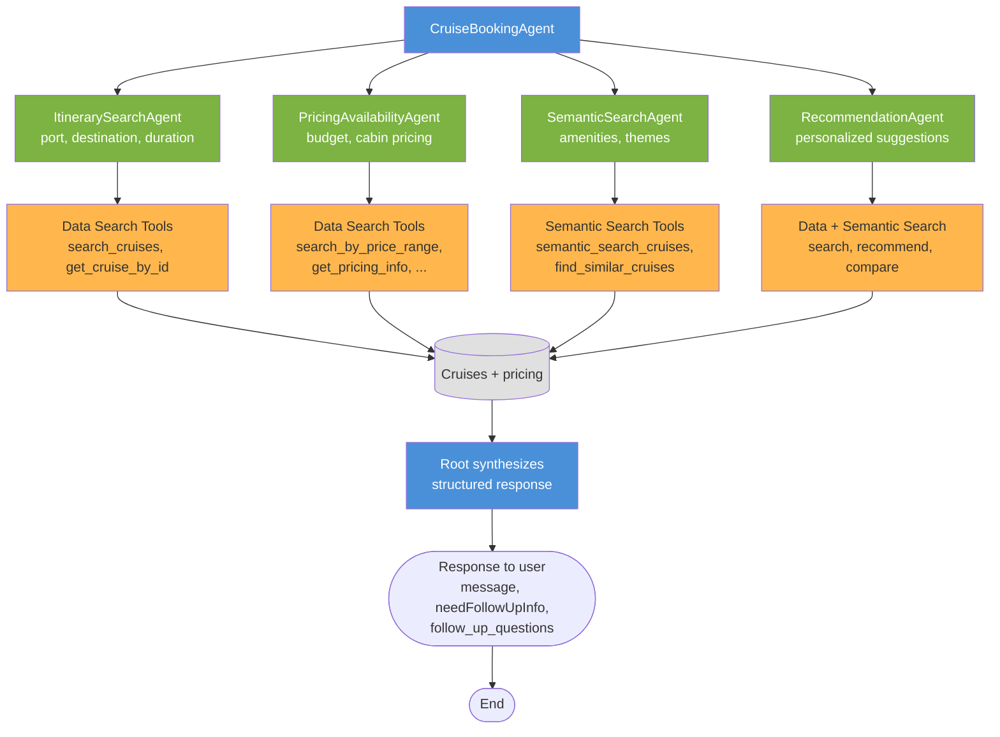

# Cruise Booking Agent

## Using This Example for AI Evaluations Demo

This cruise booking agent is set up as an **AI evaluation example**: multi-agent routing, tool use, and structured outputs make it suitable for demonstrating **evaluation methodologies** and **eval infrastructure**.

blog
https://medium.com/@droidnext/ai-evaluation-harness-a-practical-guide-for-building-reliable-agents-fa59c70dac1e


## Architecture


### Root Agent
- **CruiseBookingAgent**: Orchestrates requests, routes to sub-agents, optionally calls `get_data_stats`, synthesizes responses.

### Sub-Agents
- **ItinerarySearchAgent**: Port, destination, duration → Data Search.
- **PricingAvailabilityAgent**: Budget, cabin pricing → Data Search.
- **SemanticSearchAgent**: Amenities, themes, NL preferences → Semantic Search.
- **RecommendationAgent**: Personalized suggestions → Data + Semantic Search.

### Flow diagram (Mermaid)



*Source: `docs/cruise_booking_flow.mmd`. View at [mermaid.live](https://mermaid.live).*


## Setup

### Install Google ADK

This project is built on the Google Agent Development Kit (ADK).  
If you don't already have it installed, install it first (see the [official ADK Python quickstart](https://google.github.io/adk-docs/get-started/python/)):

```bash
pip install google-adk
```

### Project dependencies

1. Install dependencies:
```bash
pip install -r requirements.txt
```

2. Set up environment variables (create `.env` file from `env.example`):
```bash
cp env.example .env
```

Then edit `.env` with your settings:
```bash
# LLM Configuration (LiteLLM Native)
# LiteLLM auto-detects provider from model name
LLM_MODEL=openrouter/google/gemini-2.5-flash
LLM_TEMPERATURE=0.7
LLM_MAX_TOKENS=2048

# API Keys (LiteLLM Standard Environment Variables)
# Set the key(s) for the provider(s) you want to use
OPENAI_API_KEY=your_openai_api_key_here
AZURE_API_KEY=your_azure_api_key_here
ANTHROPIC_API_KEY=your_anthropic_api_key_here
OPENROUTER_API_KEY=your_openrouter_api_key_here
GOOGLE_API_KEY=your_google_api_key_here

# OpenRouter Configuration (optional)
OPENROUTER_API_BASE=https://openrouter.ai/api/v1

# Azure OpenAI Configuration (required for azure/* models)
AZURE_API_BASE=https://your-resource-name.openai.azure.com
AZURE_API_VERSION=2024-02-15-preview  # Optional

# Logging Configuration
LOG_LEVEL=INFO
LOG_FORMAT=json

# Arize Phoenix (Optional - for LLM observability)
PHOENIX_API_KEY=your_phoenix_api_key_here
PHOENIX_PROJECT_NAME=cruise-booking-agent
PHOENIX_COLLECTOR_ENDPOINT=https://app.phoenix.arize.com
```

3. Prepare and load data:
```bash
# Load data and inject into vector store
python scripts/load_data.py --inject-vector-store

# Or just validate data
python scripts/load_data.py --validate-only
```

## Usage

### Quick Start

```bash
# 1. Activate virtual environment
source .venv/bin/activate

# 2. Load cruise data
python scripts/load_data.py --inject-vector-store

# 3. Start ADK Web UI
./scripts/start_adk.sh
# Or manually: adk web agents/ --port 8000

# 4. Access Web UI
open http://127.0.0.1:8000

# Alternative: Test via command line
python tests/test_agent_queries.py --interactive
```

### Basic Usage

**Via ADK Web UI (recommended):**
```bash
./scripts/start_adk.sh
# Open http://127.0.0.1:8000 and chat with the cruise booking agent
```

**Via ADK CLI:**
```bash
adk web agents/ --port 8000 --reload
```

**Via test script:**
```bash
python tests/test_agent_queries.py --query "Find a 7-day cruise from Miami"
python tests/test_agent_queries.py --interactive
```

### Using Different LLM Providers

All agents use **LiteLLM**; the provider is inferred from `LLM_MODEL` in `.env`. Set the matching API key:

- `openrouter/*` → `OPENROUTER_API_KEY`
- `gpt-*` → `OPENAI_API_KEY`
- `claude-*` → `ANTHROPIC_API_KEY`
- `gemini-*` → `GOOGLE_API_KEY`

See `agents/cruise_booking/README.md` and `env.example` for details.

## Observability with Phoenix

Install Phoenix Arize on local . Check ./phoenix-arize/docker-compose.yaml

[Arize Phoenix](https://phoenix.arize.com) tracing for LLM calls and tool usage:

```bash
# Add to .env
PHOENIX_API_KEY=your_api_key_here
PHOENIX_PROJECT_NAME=cruise-booking-agent
PHOENIX_COLLECTOR_ENDPOINT=https://app.phoenix.arize.com
```

When enabled, Phoenix tracks prompts, responses, token usage, and agent execution traces. Tools use `@tracer.tool` / `@tracer.chain` (see `agents/cruise_booking/config.py`). Use [app.phoenix.arize.com](https://app.phoenix.arize.com) or local Phoenix via `./scripts/start_phoenix.sh`.

---

## Using This Example for AI Evaluations Demo

This cruise booking agent is set up as an **AI evaluation example**: multi-agent routing, tool use, and structured outputs make it suitable for demonstrating **evaluation methodologies** and **eval infrastructure**.

### What this example provides

- **Golden dataset** ([`evals/datasets/golden_dataset.csv`](evals/datasets/golden_dataset.csv)): ~40 test cases with queries for evaluating agent performance. Use it for end-to-end evaluation checks.

  **Example records:**
  | Test_ID | Query |
  |---------|-------|
  | TC001 | Find me a 7-day cruise from Miami to the Caribbean |
  | TC002 | Show me cruises under $2000 per person |
  | TC003 | I'm looking for a romantic cruise with spa and fine dining |
- **Evaluation spec** (`evals/datasets/evaluation_spec.md`): Defines **code-based** (schema, routing, tools), **LLM-as-judge** (relevance, completeness, coherence), and **agent-path** (sub-agent order, efficiency) evals.
- **LLM-as-judge prompts** (`evals/eval_prompts/`): YAML prompts for response relevance, completeness, coherence, query understanding, instruction following, semantic search quality.
- **Phoenix integration**: Traces support **experiments** and **eval runs**. Use Phoenix to compare model versions, prompts, or routing changes.
- **Notebooks and scripts**: `evals/notebooks/cruise_booking_eval.ipynb`, `evals/test_dataset_operations.py` for running evals and exporting results.

### How to use it for AI evaluations

1. **Run the agent** with `./scripts/start_adk.sh` or `adk web agents/`, and  enable Phoenix.
2. **Execute golden queries** (e.g. via `evals/test_dataset_operations.py` or your own harness) and capture responses, sub-agent invocations, and tool calls.
3. **Score with code-based evals**: Validate response structure (`message`, `needFollowUpInfo`, `follow_up_questions`).
4. **Score with LLM-as-judge**: Use `evals/eval_prompts/` and your judge model to rate relevance, completeness, coherence, etc.
5. **Use Phoenix** to trace runs, compare experiments, and inspect failures.


### Extending evals

- Add rows to `datasets/golden_dataset.csv` for new query types or edge cases.
- `eval_prompts/` for new criteria or judge dimensions.
- Use Phoenix experiments to compare prompts, models, or routing logic before and after changes.

## License

MIT
