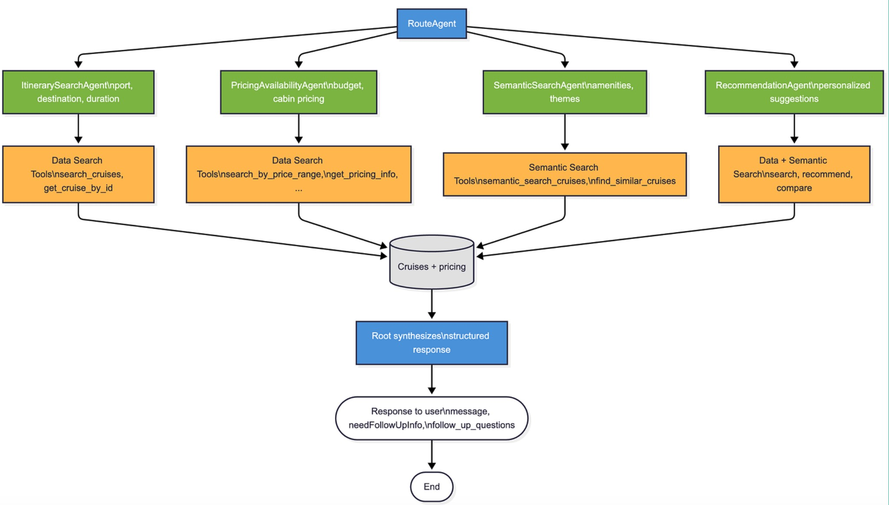
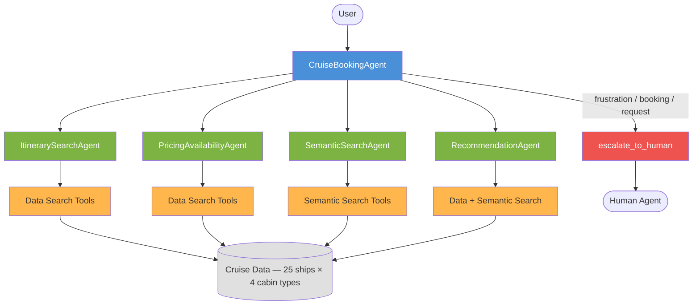

# Cruise Booking Agent

An AI-powered cruise booking assistant built on the **Google Agent Development Kit (ADK)**. Demonstrates multi-agent orchestration, tool use, human escalation, and a scenario-driven evaluation framework.

Blog: [AI Evaluation Harness — A Practical Guide for Building Reliable Agents](https://medium.com/@droidnext/ai-evaluation-harness-a-practical-guide-for-building-reliable-agents-fa59c70dac1e)

In-repo write-up: [`blog-trace-based-eval.md`](blog-trace-based-eval.md) — trace capture, offline LLM-as-judge, and using `tests/reports/` execution reports to improve routing and tools.

## Architecture



### Root Agent

- **CruiseBookingAgent** — Pure orchestrator. Routes queries to sub-agents, calls `get_data_stats` for catalog overviews, and uses `escalate_to_human` when the user requests a live agent, is frustrated, or wants to finalize a booking.

### Sub-Agents

| Agent | Purpose | Tools |
|---|---|---|
| **ItinerarySearchAgent** | Port, destination, duration, ports of call | `search_cruises`, `get_cruise_by_id` |
| **PricingAvailabilityAgent** | Budget filtering, cabin pricing, price comparisons | `search_by_price_range`, `get_pricing_info`, … |
| **SemanticSearchAgent** | Amenities, themes, natural-language preferences | `semantic_search_cruises`, `find_similar_cruises` |
| **RecommendationAgent** | Personalized cruise suggestions | Data + Semantic search combined |

### Human Escalation

The root agent has an `escalate_to_human` tool. It triggers when:

- The user explicitly asks for a person or live agent
- The user is frustrated or dissatisfied
- A booking or payment needs to be finalized
- The query falls outside the agent's capabilities (complaints, refunds, special needs)

On escalation the agent provides a reference number and a conversation summary for seamless handoff.

### Flow Diagram


```mermaid
flowchart TB
    User([User]) --> RouteAgent[CruiseBookingAgent]
    RouteAgent --> Itinerary[ItinerarySearchAgent]
    RouteAgent --> Pricing[PricingAvailabilityAgent]
    RouteAgent --> Search[SemanticSearchAgent]
    RouteAgent --> Rec[RecommendationAgent]
    RouteAgent -->|frustration / booking / request| Escalate[escalate_to_human]
    Itinerary --> Tools1[Data Search Tools]
    Pricing --> Tools2[Data Search Tools]
    Search --> Tools3[Semantic Search Tools]
    Rec --> Tools4[Data + Semantic Search]
    Tools1 --> Data[(Cruise Data — 25 ships × 4 cabin types)]
    Tools2 --> Data
    Tools3 --> Data
    Tools4 --> Data
    Escalate --> Human([Human Agent])

    style RouteAgent fill:#4a90d9,color:#fff
    style Itinerary fill:#7cb342,color:#fff
    style Pricing fill:#7cb342,color:#fff
    style Search fill:#7cb342,color:#fff
    style Rec fill:#7cb342,color:#fff
    style Escalate fill:#ef5350,color:#fff
    style Tools1 fill:#ffb74d
    style Tools2 fill:#ffb74d
    style Tools3 fill:#ffb74d
    style Tools4 fill:#ffb74d
    style Data fill:#e0e0e0
```

## Data

Cruise data lives in `data/cruises.jsonl` (95 entries). Each of the 25 ships has multiple rows — one per cabin type:

| Cabin Type | Relative Price |
|---|---|
| Interior | ~55% of Balcony |
| Oceanview | ~75% of Balcony |
| Balcony | Base price |
| Suite | ~160% of Balcony |

Cruise IDs encode the cabin suffix: `CRUISE_003_INT`, `CRUISE_003_OCV`, `CRUISE_003_BAL`, `CRUISE_003_STE`. Budget ships omit Suite; luxury/small ships omit Interior.

The Vertex AI datastore version is at `data/cruises_vertex_datastore.jsonl`.

## Setup

### Prerequisites

- Python ≥ 3.12
- [uv](https://docs.astral.sh/uv/) package manager
- Google ADK (`google-adk`) — installed automatically via dependencies

### Install

```bash
# Clone and install
git clone <repo-url> && cd agent-evals-demo
uv sync
```

### Environment

Copy the example env and fill in your keys:

```bash
cp env.example .env
```

Key variables:

```bash
# LLM — provider is inferred from the model name by LiteLLM
LLM_MODEL=openrouter/google/gemini-2.5-flash
LLM_TEMPERATURE=0.7
LLM_MAX_TOKENS=2048

# API keys (set the one matching your LLM_MODEL provider)
OPENROUTER_API_KEY=...
GOOGLE_API_KEY=...
OPENAI_API_KEY=...
ANTHROPIC_API_KEY=...

# Phoenix tracing (optional; see env.example for local vs cloud)
PHOENIX_PROJECT_NAME=cruise-booking-agent
PHOENIX_COLLECTOR_ENDPOINT=http://localhost:4317
# PHOENIX_API_KEY=...  # cloud Phoenix

# Local trace export for offline eval (optional)
LOCAL_TRACE_ENABLED=true
# LOCAL_TRACE_DIR=.traces_local
```

### Load Data

```bash
uv run python scripts/load_data.py --inject-vector-store

# Or validate only
uv run python scripts/load_data.py --validate-only
```

## Usage

### ADK Web UI (recommended)

```bash
./scripts/start_adk.sh
# Or: uv run adk web agents/ --port 8000 --reload
open http://127.0.0.1:8000
```

### CLI

```bash
uv run python tests/test_agent_queries.py --query "Find a 7-day cruise from Miami"
uv run python tests/test_agent_queries.py --interactive
```

### LLM Providers

All agents use **LiteLLM**; the provider is inferred from `LLM_MODEL`:

| Model prefix | API key variable |
|---|---|
| `openrouter/*` | `OPENROUTER_API_KEY` |
| `gpt-*` | `OPENAI_API_KEY` |
| `claude-*` | `ANTHROPIC_API_KEY` |
| `gemini-*` | `GOOGLE_API_KEY` |

## Observability with Phoenix

Tracing is managed by `agents/cruise_booking/tracing_util.py`. Call `initialize_tracing()` once at startup — it's idempotent and safe to call multiple times.

### Local Phoenix (Docker)

```bash
cd phoenix-arize && docker compose up -d
# UI: http://localhost:6006
# Traces are sent via gRPC to localhost:4317
```

### Cloud Phoenix

Set `PHOENIX_COLLECTOR_ENDPOINT` and `PHOENIX_API_KEY` in `.env`.

### Instrumentation

When tracing is enabled, the following are auto-instrumented:

- LiteLLM
- Google ADK
- OpenAI
- Vertex AI

Tools use `@tracer.tool` / `@tracer.chain` decorators for span tracking.

## Multi-Turn Scenario Tests

The project includes a **two-phase** scenario harness: run the agent and capture traces, then judge offline (optional).

### Phase 1 — Run scenarios

```bash
# Enable local trace export for offline judging (recommended)
export LOCAL_TRACE_ENABLED=true
uv run python tests/scenarios_runner.py
```

**Execution reports** (sub-agent routing, per-turn timing, full responses) are written to `tests/reports/` as `exec_<timestamp>.md` and `exec_<timestamp>.json`. These are gitignored; use them to spot routing issues, latency spikes, and tool/SQL problems before or alongside LLM judging.

Options:

```bash
uv run python tests/scenarios_runner.py --list              # List scenarios
uv run python tests/scenarios_runner.py --scenario "Budget" # Filter by title
uv run python tests/scenarios_runner.py --verbose           # Print full responses
```

### Phase 2 — LLM-as-judge (offline)

Reads the latest `.traces_local/<run>/` directory and scores each turn against scenario expectations:

```bash
uv run python evals/tests/scenarios_llm_judge.py
```

**Judge reports** (PASS/FAIL per turn, reasons, tool usage from traces) are written to `evals/reports/` as JSON and Markdown.

### Scenario structure

Scenarios are defined in `tests/scenarios/scenarios.yaml` (see the file header for `tool_calls_expected` schema docs) and reference JSON turn files:

```
tests/scenarios/
├── scenarios.yaml              # Registry + documentation comments
├── search_and_book.json        # 5-turn search → pricing → booking flow
├── destination_comparison.json
├── family_vacation.json
├── budget_constrained.json
└── itinerary_deep_dive.json
```

Each turn typically includes:

- **`input`** — user text, optional `parameters`, `context`
- **`expected`** — natural-language behavior description for the LLM judge
- **`tool_calls_expected`** (optional) — assertions on tools seen in traces (`required`, `forbidden`, `exact`, `max_calls`, `none`)

### Reports summary

| Output | Location | Purpose |
|--------|----------|---------|
| Execution report | `tests/reports/exec_*.md` / `.json` | What the agent did — routing, timing, responses (improve prompts & transfer logic) |
| Trace spans | `.traces_local/<timestamp>/` | Full OpenInference spans for debugging and the judge |
| Judge report | `evals/reports/judge_*.{md,json}` | How well the agent met expectations (quality + tool checks) |

### Example: Search and Book Flow (5 turns)

| Turn | User | Tests |
|---|---|---|
| 1 | "What destinations do you have?" | Destination listing, sub-agent delegation |
| 2 | "Show me 7-day cruises from Miami" | Filtered search, structured results |
| 3 | "What's the price range?" | Context retention, pricing lookup |
| 4 | "Tell me about the cheapest option" | Cross-turn reference, itinerary detail |
| 5 | "What cabin types are available?" | Multi-cabin-type listing, booking escalation |

## Evaluation Framework

This project is set up as an **AI evaluation example** — multi-agent routing, tool use, and human escalation make it suitable for demonstrating evaluation methodologies.

### What's included

- **Golden dataset** ([`evals/datasets/golden_dataset.csv`](evals/datasets/golden_dataset.csv)) — ~40 test cases for end-to-end evaluation
- **Evaluation spec** (`evals/datasets/evaluation_spec.md`) — Code-based (schema, routing, tools), LLM-as-judge (relevance, completeness, coherence), and agent-path evals
- **Multi-turn scenarios** — [`tests/scenarios_runner.py`](tests/scenarios_runner.py) + [`evals/tests/scenarios_llm_judge.py`](evals/tests/scenarios_llm_judge.py) for trace-backed runs and offline judging
- **LLM-as-judge prompts** (`evals/eval_llm_judge/`) — YAML prompts + rubrics for response quality dimensions
- **Notebooks** — `evals/notebooks/cruise_booking_eval.ipynb` for running and analyzing evals

### Running evals

1. Start the agent: `./scripts/start_adk.sh` (enable Phoenix for tracing)
2. Run golden queries via `evals/test_dataset_operations.py` or your own harness
3. Score with code-based evals (response structure) and LLM-as-judge (quality)
4. Use Phoenix to trace runs, compare experiments, and inspect failures

### Extending

- Add rows to `evals/datasets/golden_dataset.csv` for new query types
- Add prompts to `evals/eval_llm_judge/` for new judge dimensions
- Use Phoenix experiments to A/B test prompts, models, or routing changes

## Project Structure

```
agents/cruise_booking/
├── agent.py              # Root agent definition
├── config.py             # Environment config (model, Phoenix, LOCAL_TRACE_*)
├── tracing_util.py       # Phoenix + optional LocalFileExporter (.traces_local/)
├── prompt_loader.py      # YAML prompt loading
├── prompts/              # Agent instruction prompts (YAML)
├── sub_agents/           # Sub-agent definitions
└── tools/                # Tool implementations (data search, semantic search, escalation)
data/                     # Cruise data (JSONL, Parquet)
evals/
├── datasets/             # Golden dataset, evaluation spec
├── eval_llm_judge/       # LLM-as-judge YAML prompts + rubrics
├── notebooks/            # Eval analysis notebooks
├── reports/              # Judge outputs (from scenarios_llm_judge.py)
└── tests/
    └── scenarios_llm_judge.py  # Offline trace-based judge
tests/
├── scenarios_runner.py   # Multi-turn scenario runner → tests/reports/
├── scenarios/            # scenarios.yaml + per-scenario JSON
└── reports/              # Execution reports exec_*.md / .json (gitignored)
scripts/                  # Startup, data loading, Phoenix verification
phoenix-arize/            # Docker Compose for local Phoenix
```

## License

MIT
